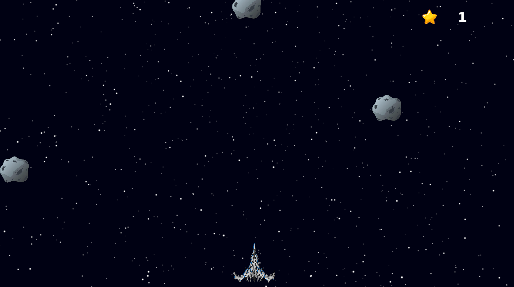
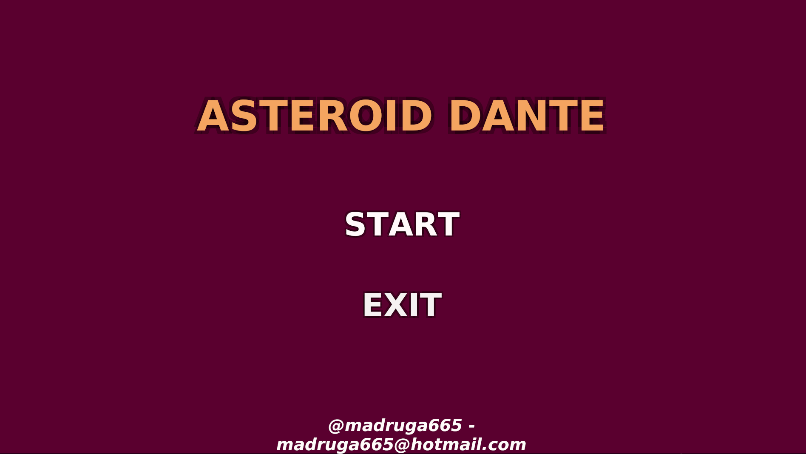
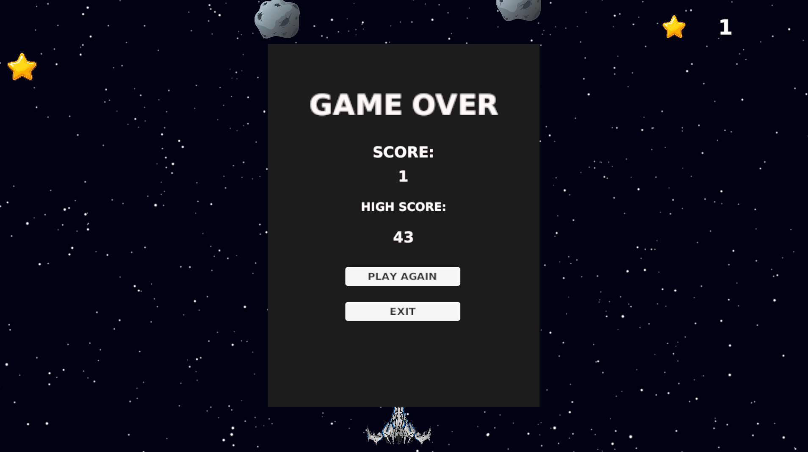

# Asteroid Dante

**Asteroid Dante** é um jogo de ação arcade desenvolvido em Unity, onde você assume o controle de uma nave espacial em uma missão perigosa pelo cosmos. O desafio é simples, mas viciante: colete o máximo de estrelas que puder enquanto desvia habilmente de asteroides mortais que cruzam seu caminho.

## 🚀 Como Jogar

O objetivo é sobreviver o maior tempo possível e alcançar a maior pontuação.

1. **Movimentação:** Use as teclas **W, A, S, D** ou as **Setas do Teclado** para mover sua nave.
2. **Objetivo:** Colete as **Estrelas** para aumentar sua pontuação.
3. **Perigo:** Evite o contato com os **Asteroides**. Um único impacto resultará em fim de jogo (*Game Over*).
4. **Dificuldade Progressiva:** Fique atento! À medida que você coleta mais estrelas, a velocidade do jogo aumenta, testando seus reflexos ao limite.

## 🛠️ Tecnologias Utilizadas

* **Engine:** Unity 6 (6000.4.5f1)
* **Linguagem:** C#
* **Renderização:** Universal Render Pipeline (URP) 2D
* **Assets:** Sprites 2D e efeitos sonoros personalizados.

## 🎮 Mecânicas do Jogo

* **Sistema de Pontuação:** Cada estrela coletada adiciona um ponto ao seu contador.
* **Recorde (High Score):** O jogo salva automaticamente sua melhor pontuação localmente.
* **Gerador Aleatório:** Asteroides e estrelas surgem de diferentes pontos fora da tela em intervalos de tempo variados.
* **Aceleração de Tempo:** O jogo fica mais rápido nos marcos de 10, 20, 30, 40, 50, 60 e 100 estrelas.

## 📸 Screenshots

Aqui estão alguns momentos do jogo:

### Menu Inicial

### Gameplay

### Fim de Jogo

## 📁 Estrutura do Projeto

* `/Assets/Scripts`: Contém toda a lógica do jogo (movimentação, geração de objetos, menus).
* `/Assets/Objects2D`: Sprites utilizados na nave, estrelas e asteroides.
* `/Assets/Prefabs`: Objetos pré-configurados para fácil instanciação.
* `/Assets/Soud Effects`: Efeitos sonoros e trilha sonora.

---
Desenvolvido com ❤️ por @madruga665
